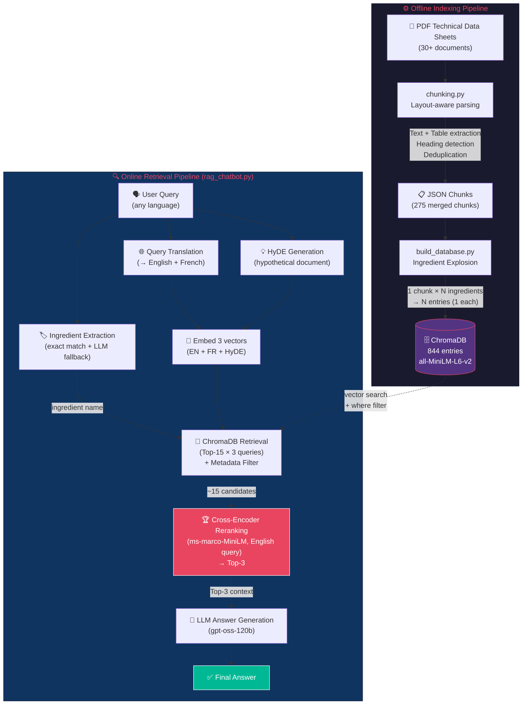

# Advanced RAG System for Technical Document Retrieval

This project implements a highly accurate, language-agnostic Retrieval-Augmented Generation (RAG) pipeline tailored for complex technical documents, such as Technical Data Sheets containing strict specifications, regulatory bounds, and tabular comparisons across various ingredients/products.


## Pipeline Architecture



## 1. The Chunking Strategy (`chunking.py`)

The extraction and chunking strategy is designed to parse highly complex PDF documents into structured, retrieval-ready JSON chunks.

> **Note**: While the folder path may mention "enzymes," this pipeline is entirely generalized to parse any PDF dataset. "Enzymes" merely represents one sample category of the possible ingredients.

### Dynamic Layout-Aware Chunking
To make the extracted data optimal for Vector Databases and RAG, we split the document into bite-sized, semantically rich **"Chunks"**:
1. **Text Chunks**: A specific paragraph or contiguous block of text paired directly with its closest **Section Title**.
2. **Table Rows**: Granular chunks representing a single row of a table, keeping the context of the columns and the overall table title intact.

### How the Parser Works (Step by Step)
The script is built on **PyMuPDF (`fitz`)**, using both spatial text extraction (`page.get_text("dict")`) and native table detection (`page.find_tables()`):

1. **Page-by-Page Scanning**: Each PDF page yields two types of elements — text blocks and tables. Their bounding boxes are extracted and merged into a single list.
2. **Top-to-Bottom Sorting**: All elements are sorted by their vertical position (`y0`) and horizontal offset (`x0`), ensuring the parser reads the page exactly as a human would — chronologically from top to bottom, left to right.
3. **Table vs. Text Separation**: Each text block's bounding box is checked for intersection against every detected table's bounding box (with a 1px shrink to avoid false positives on borders). Text inside a table is excluded from text processing since the table handler processes it separately.
4. **Section Heading Detection**: As the parser reads downward, any text block with a font size ≥ **11.5pt** and fewer than 60 characters is classified as a **Section Heading** (e.g., "Product Description", "Dosage", "Application"). All subsequent normal-sized text is accumulated under that heading until a new heading appears.
5. **Noise Filtering**: Repeating boilerplate (headers, footers, URLs, brand logos, trademark symbols, "Last Updating" dates) is proactively filtered out using pattern matching on the lowercased text, avoiding polluting the vector space with irrelevant content.

### Smart Table Classification
When the parser encounters a table, it classifies it dynamically based on context:

* **Regulatory Limits Tables** (triggered when `"FOOD SAFTY"` appears in the section title or first row):
  * These tables often have **merged left columns** (e.g., *Heavy metals* spanning across *Cadmium, Mercury, Arsenic, Lead*). The parser remembers the `last_category` from the left column and applies it to subsequent rows, even when the left cell is empty.
  * Each row becomes its own chunk, e.g.: `"Physicochemical: Microbiology - Total plate count: <50,000 UFC per g"`

* **Generic Tables** (everything else):
  * The first row is treated as headers. Each subsequent row is flattened into a `header: value` string preserving full context.
  * Example output: `"Alternative: Levain naturel | Avantages: Action douce | Inconvénients: Temps long"`
  * For conversion/dosage tables with numerical data, each row becomes: `"Poids Farine: 500 kg | 50 ppm: 25 g | 75 ppm: 37,5 g"`

This ensures complex tables are handled flawlessly, while remaining entirely future-proof for completely unknown structural formats without breaking the pipeline.

### Global Data Deduplication (Chunk Merging)
Instead of keeping thousands of duplicate chunks across 30+ PDFs, the script globally hashes identical chunks together. If 20 different PDFs contain the exact same regulatory row for *"Lead (< 5 mg/kg)"*, they are compressed into a **single JSON chunk** with an array of all 20 `ingredients`. This dramatically reduces noise and redundancy in the vector space.


## 2. Building the ChromaDB (`build_database.py`) & Solved Filtering Problem

### The Filtering Problem
Initially, global data deduplication created an issue for the RAG pipeline. A single chunk could relate to 5 different ingredients (`ingredients: ["IngA", "IngB", "IngC"]`). 
When storing this as metadata in ChromaDB, the system would use a comma-separated string (`"IngA, IngB, IngC"`). 
When querying the Vector DB using the `$contains` metadata filter to scope down to a specific ingredient, ChromaDB returned false positives and false negatives because text substring rules against comma-separated arrays are brittle. 

### The Solution: Database Explosion
In `build_database.py`, we employ an **"Explosion"** strategy:
Instead of storing multi-ingredient chunks globally, the script **explodes** these chunks as it inserts them into ChromaDB. 
* **Before**: 1 chunk → 1 DB entry (`metadata={"ingredients": "A, B, C"}`)
* **After**: 1 chunk → 3 distinct DB entries (`metadata={"ingredient": "A"}`, `metadata={"ingredient": "B"}`, etc.)

**The result**: We can now execute an exact-match `where={"ingredient": "IngA"}` ChromaDB query. This guarantees **100% Context Precision**, guaranteeing that the retrieved chunks strictly pertain to the exact target ingredient requested by the user.


## 3. Advanced Retrieval Pipeline (`rag_chatbot.py`)

The retrieval mechanism is heavily optimized to address the classic limitations of plain semantic search through several innovative combinations:

1. **Intelligent Query Extraction**: The LLM intercepts the raw user query to definitively extract the target ingredient to search for. This unlocks the powerful explicit-filtering mechanism described above.
2. **HyDE (Hypothetical Document Embeddings)**: Instead of embedding the user's short query directly against long technical chunks, the LLM hallucinates a hypothetical, perfect technical document answer to the query. This hypothetical answer heavily aligns with the semantic structure of the actual technical chunks, significantly boosting the similarity match.
3. **Dual-Language Querying (Cross-Lingual Retrieval)**: User queries are translated to run parallel vector searches in both English and French. All results (English semantic, French semantic, and HyDE) are retrieved, deduplicated, and ranked.
4. **Resilient Fallbacks**: If the strict metadata filter yields insufficient results (due to naming mismatches), the chatbot autonomously falls back to a purely broad semantic search.
5. **Cross-Encoder Reranking**: After retrieving 15 candidates, a cross-encoder model (`ms-marco-MiniLM-L-6-v2`) reranks them using the English translation of the query. Unlike bi-encoders that compare embeddings independently, cross-encoders jointly encode query-document pairs, dramatically improving content relevance. This boosted hit rate from 78% to **92%** at K=3.


## 4. Evaluation Technique (`evaluation.py`)

Evaluating RAG in technical domains requires absolute precision. Our evaluation pipeline generates 100 strict queries using ground-truth validation:

* **Strict Relevance Metric**: An answer is only marked as a "hit" if both:
   1. The `ingredient` extracted perfectly matches the expected ground-truth ingredient.
   2. The document text semantically matches/contains the exact numeric strings and technical specifications from the source PDFs. 

Comparing pure semantic search to our filtered approach shows a massive boost in accuracy, pushing Context Precision to 100%, and driving overall recall and NDCG upward drastically.

### Metrics Summary (100 queries across 4 difficulty tiers):

Queries include 4 difficulty levels: **Easy** (exact ingredient name), **Medium** (abbreviated names), **Hard** (natural language, no ingredient name), and **Adversarial** (cross-ingredient comparison).

| Approach | Hit Rate @K=3 | Context Precision @K=3 | MRR |
|----------|-------------|----------------------|-----|
| Semantic Search only | 48% | 45% | 0.360 |
| + Metadata Filtering | 78% | 100% | 0.620 |
| **+ Cross-Encoder Reranking** | **92%** | **100%** | **0.845** |


## 5. How to Run & Test

1. **Install Dependencies**:
   ```bash
   pip install pymupdf sentence-transformers chromadb openai numpy
   ```

2. **Set up the LLM API Key**:
   The code relies on the free **Lightning AI API**. It provides an incredibly generous free tier (over 700M generated tokens for free).
   Set your API key exactly as follows:
   **Windows (Command Prompt):**
   ```cmd
   set LIGHTNING_API_KEY=your_lightning_ai_api_key_here
   ```
   **Linux/Mac:**
   ```bash
   export LIGHTNING_API_KEY="your_lightning_ai_api_key_here"
   ```

3. **Run the Database Builder (Optional)**:
   ```bash
   python chunking.py
   python build_database.py
   ```
   Note: The `all_extracted_chunks_merged.json` and `chroma_db` folder are natively referenced through relative paths, so they work out of the box.

4. **Run the Chatbot**:
   ```bash
   python rag_chatbot.py
   ```
   You can interactively ask questions directly to the multi-lingual assistant (e.g., *"Quel est le dosage de BVZyme TDS L MAX64 ?"* or *"What are the allergens in TDS BVzyme HCF MAX63?"*).

5. **Run the Evaluator**:
   ```bash
   python evaluation.py
   ```
   This will run exactly 100 pre-configured complex benchmark queries to validate the 100% Context Precision hit rate, and export a clean, truncated log to `evaluation_results.txt`.
